# Advance IPv6 - IPv6

## 問題01 - IPv6 Static Route

1. トポロジを参考にIPアドレスを適切に割り当てる
1. スタティックルートを用いて適切にルーティングする
2. `PC1` から `PC2` へ `ping` ができるか確認

## 問題02 - IPv6 over IPv4 トンネリング

1. トポロジ図を参考にIPを割り当てる
2. R2, R3, R4 間を OSPFv2 で適切にルーティング
3. R2 と R4 の間で IPv6 over IPv4 トンネリングを有効化 (8000::/64 プレフィックスを使用して下さい。)
4. `R1` と `R2`, `R4` と `R5` それぞれで RIPING を使い適切にルーティング
5. `R1` から `R5` に `ping` で疎通できるか確認
