# Basic ACL  アクセスコントロールリストをしてみよう！

## 問題01 標準ACL

### 手順

* 基本設定
    1. IPアドレスを振る
    2. スタティックルートなどでPC1,PC2が全てのルーターと通信可能になるようにする

 

* 標準ACL設定
    * Router1に設定する場合
        1. ACLを制作する
        2. 対応するインターフェースに設定する
    * Router2に設定する場合
        1. 同上 *※Roouter1との設定の違いに注意*

 

### 確認
1. `PC1`は`Router1`,`Router2`と通信できる
2. `PC2`は`Router1`と通信できるが、Router2と通信できない

----

