# Basic DHCP01 - DHCPを設定してみよう

## 問題01



```markdown
制約

- PC1-2 には DHCPサーバを使用するようにすること。手動でIPを設定してはならない

- DHCPサーバの設定
  - プール名 ECC とする
  - リース期間は30分とする
  - ルータで使用するアドレスは除外
```

1. `R1` で DHCPサーバを動作させる。（上の設定を参考にして下さい）
2. `PC1` から `PC2` へ `ping` ができるか確認

## 問題2



```
制約

- 172.16.0.0 ~ は自由に使えるが `PC1-500` と `R1` のセグメントには 約500台が接続する予定なのでそれを踏まえ適切にサブネットマスクを設定すること。
またそのセグメントに面する `R1` のインターフェースには設定可能な最後の番号を使用すること。

- PC1 ~ PC500 には DHCPサーバを使用するようにすること。手動でIPを設定してはならない

- DHCP の設定
  - リース期間を 2時間に設定する
  - 設定可能な最後の番号から 10個 IP を除外すること
```

1. 上記を満たすアドレス範囲を考えなさい。
2. 適切に機器を設定しなさい。
3. `PC1` から `DHCP1` へ `ping` が飛ぶことを確認。