# Basic_Nat01 NATをしてみよう

## 問題01 スタティックNAT

### 設定
#### inside
1. IPアドレスを振る
2. `R1`にスタティックNAT(inside)を設定する
3. `R1`のインターフェースを割り振る
#### outside
* ほぼ同じ 
※insideとの設定の違いに注意
### 確認
* `PC1`から`R2(10.0.0.2)`にpingが通る
----

## 問題02 ダイナミックNAT(NATプール)

### 設定
1. IPアドレス振る
2. `R1`にNATプール設定
3. `R1`にACL設定
### 確認
* `PC1,PC2,PC3`から`R2(10.0.0.2)`にpingが通る
----

## 問題03 PAT(NAPT) IPマスカレード
※デバイス構成はダイナミックNATと同じ

### 設定
##### ※ダイナミックNATから続けて設定する場合、ダイナミックNATは消しておく
1. `R1`にPAT設定
2. `R1`にACL設定
 
### 確認
* `PC1,PC2,PC3`から`R2(10.0.0.2)`にpingが通る
----
## 問題4 検証問題

### 設定
1. `R1とR2`間のIPアドレスを10.0.0.0/`28`→10.0.0.0/`30`に変更
2. ダイナミックNAT設定
3. PAT設定

### 確認
* 2と3の違いを確認し、理由を考える
----
## ※show ip nat translationsで変換内容を確認すること