# Basic Routing01 - ダイナミックルーティング

## 問題01

* [ ] スタティックルートで組んだときにスタティックルートの設定は何個設定すれば良いか？ (ip route ~~~ の数)
  * 答え:

1. 好きなルーティングプロトコルを使用しルーターを設定。
2. PC側に割り当て可能な最初のアドレス、ルーター側には割り当て可能な最後のアドレスを割り当てる。
3. ルーター動詞のアドレスは左側が若番を使用する。
2. `PC1` から `PC2` に `ping` が出来るようにする。
（一回できたら削除し別のルーティングプロトコルを使用し `1.` から行ってみましょう）

## 問題02 - ルート再配送

### 前提

*  PC, ルーター間はPC側に割り当て可能な最初のアドレス、ルーター側には割り当て可能な最後のアドレスを割り当てる。
* ルータは左側が若番

### 手順

1. `R1`, `R2` を設定。
2. `R2`, `R3` を設定。
2. `PC1` から `PC2` に `ping` が出来るようにする。