# Basic Routing BGP01 - ダイナミックルーティングをしてみよう（BGP）

## 問題 01

### 前提

- 上記の AS 番号を使用すること。
- R1,R2 間は iBGP を使用し、R2,R3 間は eBGP を使用すること。

### 問題

1. `PCA` から `PCB` に `ping` が出来るようにしなさい。

### 手順

1. 各ルータに**AS 番号**を設定する。
2. 各ルータに **BGP ネイバー**が確立されるのを確認する。
3. 広報しなければならないルートを考え、広報する設定をする。
4. `PCA` から `PCB` に `ping` が出来るようにする。
