# Basic server-lamp

### #CentOSを使っています
## 問題01

1. `curl localhost`をして`welcome to Network-Club`と出るようにしなさい
2. 1ができた前提として、`curl localhost` をした時に、`phpinfo`が出るようにしなさい
3. MySQLサーバーインストールして、rootでログインしなさい
4. 3を前提として、MySQLにデータを挿入して、`curl localhost`に接続し、MySQLに挿入したデータを取り出して、表示しなさい

### 以下を調べなさい
- Document rootとは
- /var/www/htmlとは  
- `infophp()`とは
- リポジトリとは

### 手順
LAMP構築
- LAMPとは,Linux,Apache,MySQL,PHPの頭もじを合わせて略語で、オープンソースの人気の4つのサービスを合わせたもの
- 
- Linux 
- Apache 
- MySQL
- PHP

- 必須コマンド 　
  - `su` #rootユーザーにログイン
  - `sudo`  #`sudo`を前につけると、rootユーザーで実行
  - `yum install [サービス名]`   でインストールコマンド  
  - `systemctl [status or start or stop or restart ] [サービス名]`  でサービス操作

- 使うであろうコマンド,` vi` ,` cat` ,` cd` ,` mv` ,` cp` 

## 問題2
googleで調べながら設定しなさい

1. VirualBoxではなく、自分のブラウザから、ipアドレスを入力して、localhostを見れるようになさい 
2. SELinuxをDisableに設定しなさい
3. VirtualHostの設定をしなさい

### 以下を調べなさい
- firewallとは、
- SELinuxとは
- ウェルノウンポートとは
- VirtualHostとは

### 手順

- ヒント : firewall  , httpd.conf  