# Basic VLAN - VLAN

## 問題01

### 手順

1. 各Switch に VLAN を作成しなさい。
2. `SW1` と `SW2` のポートはトランクにしなさい。
2. ping の確認。
  - `PC1` から `PC3` に ping ができるか確認しなさい。
  - `PC1` から `PC4` に ping ができるか確認しなさい。
  - `PC2` から `PC3` に ping ができるか確認しなさい。
3. このトポロジは物理的には上記のように接続されているが、論理的にどうなっているか PC4台とSwitch2台を使って図で示して下さい。

## 問題2

### 手順

1. 問題1 が出来ていること前提。
2. R1 に VLAN10 と VLAN20 インタフェースにそれぞれの設定できる最大の老番設定しなさい。
2. ping の確認。
  - `PC1` から `PC3` に ping ができるか確認しなさい。
  - `PC1` から `PC4` に ping ができるか確認しなさい。
  - `PC2` から `PC3` に ping ができるか確認しなさい。
3. このトポロジは物理的には上記のように接続されているが、論理的にどうなっているか PC4台とSwitch2台を使って図で示して下さい。

<!-- 1. ルータには割り当て可能な老番を指定していき、PC側には若番を指定していく。
2. Switch VLAN1 に IP とデフォルトゲートウェイを設定しなさい。
3. 適切にルーティングさせ、`PC1` から `SW1` に `ping` が出来るようにしなさい。 -->

