# Basic VRRP - VRRPをしてみよう

## 問題01

### 手順

#### 基本設定

1. 各種機器にIPを設定しなさい。

#### ゲートウェイ冗長化設定

1. VRRP によるゲートウェイ冗長化設定をしなさい
  * `R1` がマスタになるようにプライオリティを設定する。

### 確認

1. `PC1` から `8.8.8.8` へ `traceroute` をしコマンドを使用してどのような経路を通るか確認しなさい。
2. VRRP のプライオリティの初期値と仮想MACアドレスを確認しなさい。