# NAT - NAT 問題

## 問題01

**点線の枠組みの所**

1. `PC1`, `SW1`, `R2` にそれぞれ IP を設定。
2. `PC1`, `SW1` が疎通確認できることを確認。
3. `SW1` に HTTP サービスを有効化し `PC1` のブラウザに `SW1` の IP アドレスを入力しサイトにアクセスできることを確認。

**上記ができたら**

1. `PC1` を `R1` に繋ぎ替え `R1`, `PC1` を設定。 
2. `PC1` から `SW1` のサイトにアクセスできることを確認。

セキュリティの観点から直接 `SW1` の IP を外部（上記の図の左側）に晒さないようにしたい。

4. `PC1` から `10.0.0.2` にアクセスするとサイトが表示されるよう変更。
5. `PC1` から `10.0.0.2` のサイトにはアクセスできるが ping は通らないように変更。（HTTP のみ通るように変更。）

**確認**

* [ ] `PC1` から `10.0.0.2` にブラウザでアクセスするとサイトが表示される。
* [ ] `PC1` から `SW1`, `R2` は ping で疎通確認できない。
