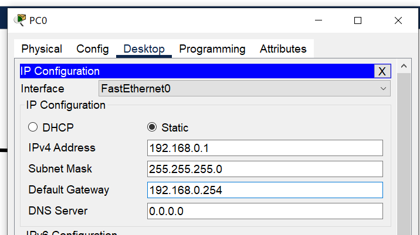
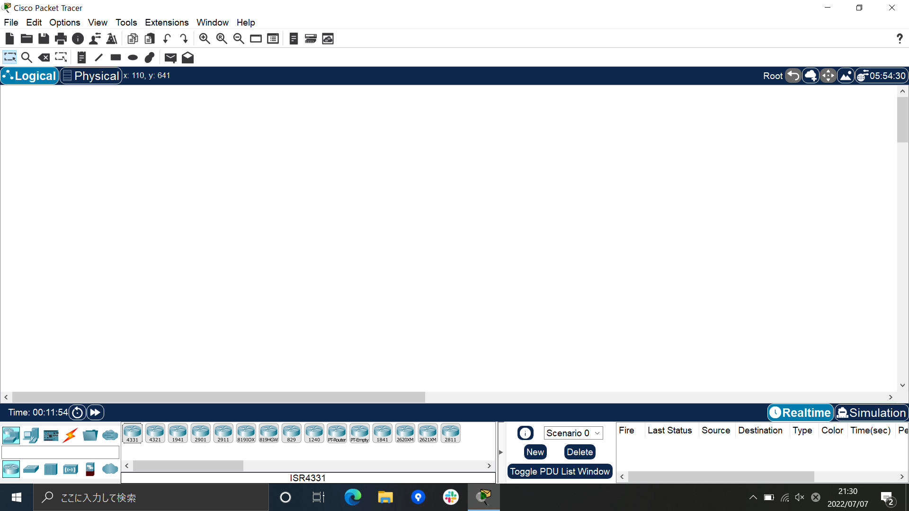
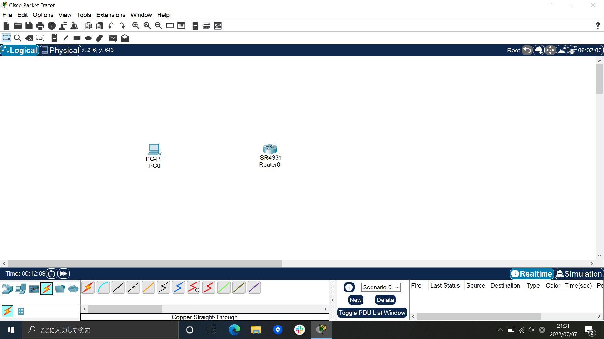
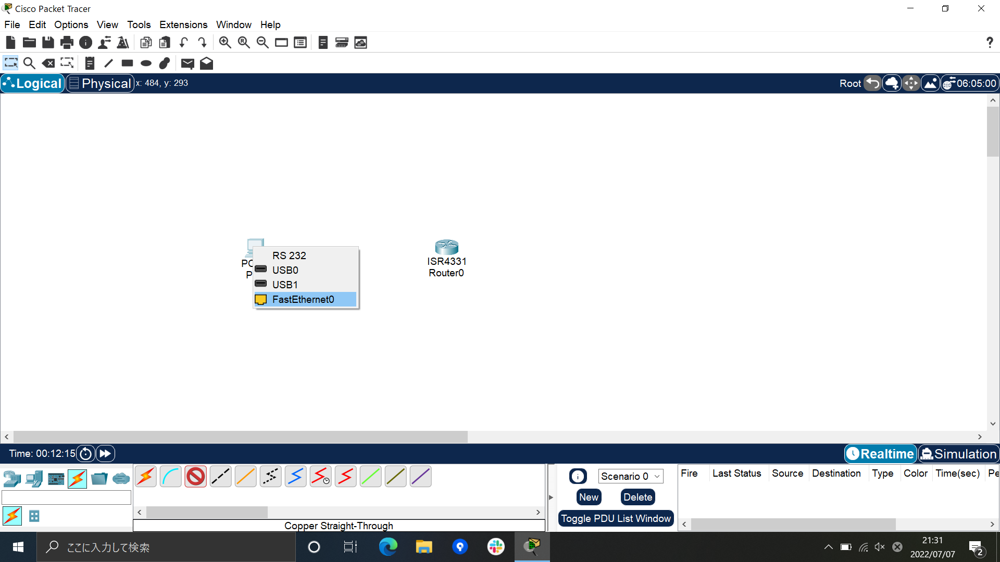
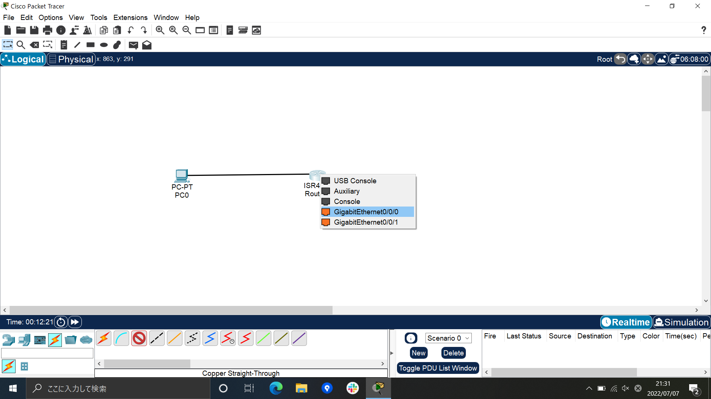
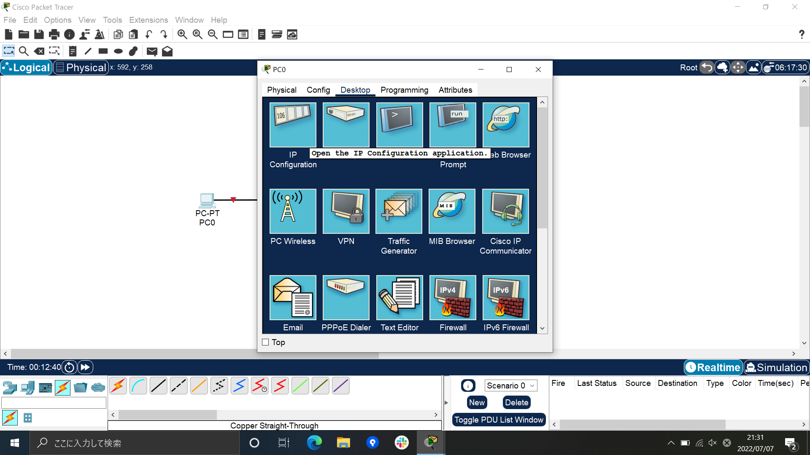
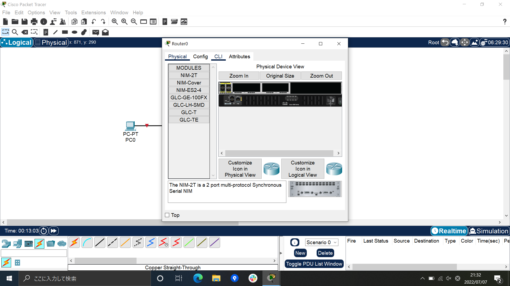

# Packet Tracerをインストールしよう
## Packet Tracerとは
### ciscoの機器を`仮想上`で扱える無料のソフトウェア

### 機器の設定が簡単にできる
* Router 

* PC 

* ping 

## インストール方法
### Ciscoアカウントがない場合
1. [こちらのサイトにアクセス](https://www.netacad.com/courses/packet-tracer/introduction-packet-tracer)して
「Sign up today」を選択し、「English」をクリック
2. 登録画面に必要項目を入力し「submit」をクリック
3. アカウント作成画面に入力 ※会社名は必須ではない
4. サインイン画面にパスワードを入力して、登録したメールアドレスに届いた「コード」を入力
5. 移行した画面に項目を入力してアカウント作成
6. コース開始の必要はないので「×」ボタンクリック
* 詳しくは、[こちらのサイト](https://www.infraexpert.com/info/packettracer02.html)を確認

### アカウント作成した場合
1. アカウント登録後のWebサイトで画面上の「リソース」を選択し「Packet Tracerのダウンロード」を選択
2. Windows版、Linux版、macOS版があるので、Cisco Packet Tracerをインストールする環境にあわせてダウンロード
3. 2でダウンロードしたexeファイルをダブルクリック ※インストールには416.6MB必要
4. そのままnext(全てnextでOK)→install→finish
5. ※「Would you like to run multi-user when application starts?」(マルチユーザー接続)を聞かれたら「NO」
6. ※ファイアウォールでブロックされたら、「プライベートネットワーク」に`☑→アクセスを許可する`
7. 認証画面にて、Ciscoアカウントのメールアドレスとパスワード入力
* 詳しくは[こちらのサイト](https://www.infraexpert.com/info/packettracer03.html)を確認
## 使い方
1. 画面 

2. 左下のメニューからデバイスを配置する 

3. ケーブルメニューから機器のインタフェース接続 

4. PCをクリックして「Desktop」タブから左上、「IP」を選択 

5. IPアドレス振る 

6. Routerクリックして真ん中、「CLI」タブクリック 

7. 設定 

8. PCの「Desktop」タブから「Command Pronpt」(上段、左から4つ目)選択 

9. Routerにping 

## お疲れさまでした！